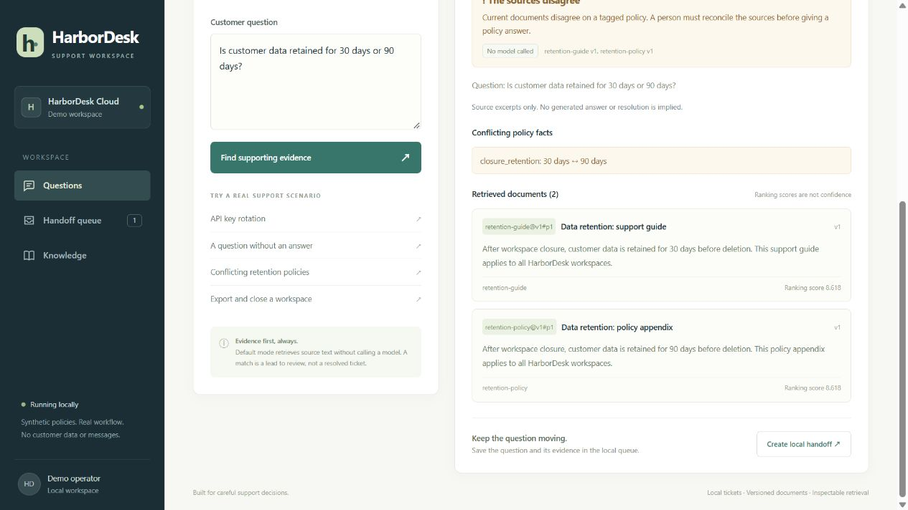
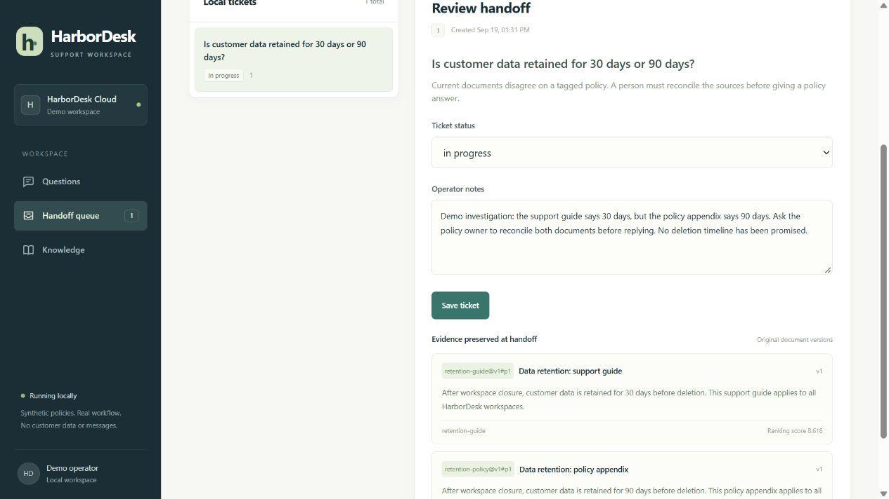

# HarborDesk · Support answers you can check

[中文说明](README.zh-CN.md) · [Evaluation results](docs/evaluation-results.json) · [References](docs/references.md)

A support agent at a small B2B software company needs to answer a customer question without guessing a policy. **HarborDesk turns that question into document excerpts with visible sources, or a local ticket for a person to investigate.** An editor can update a policy and the next search uses the new version.

**Personal demonstration using synthetic business documents. Not paid client work.** HarborDesk is fictional. The working default is **retrieval + quotations + human handoff**. No language model is called in that mode. The optional local Ollama interface has transport tests; a real model has **not** been validated.

## Try it in five minutes

Python 3.11+; tested on Python 3.14 / Windows. No API key, Docker, vector database, or model download is needed.

~~~bash
git clone https://github.com/myp81607-dot/ai-assistant-evaluation-demo.git
cd ai-assistant-evaluation-demo
python -m venv .venv
# macOS / Linux:
source .venv/bin/activate
# Windows PowerShell instead:
# .venv\Scripts\Activate.ps1
python -m pip install -r requirements-app.txt
python -m uvicorn support_app.main:create_app --factory --host 127.0.0.1 --port 8123
~~~

Open **http://127.0.0.1:8123**. First start seeds 13 synthetic documents into `runtime/support.db`. Changes and tickets persist there. Set `SUPPORT_DB` to a new file for a separate fresh demo. Existing databases are not reseeded on restart.

| Try this | Inspect the result |
| --- | --- |
| How do I rotate an API key? | Exact instructions and source `api-keys@v1#p1`. |
| How do I export data and close my workspace? | Evidence from both export and closure guides. |
| Can I get a refund after 30 days? | Insufficient coverage; create a handoff instead of inventing refund terms. |
| What is the data retention period? | Deliberately conflicting 30-day / 90-day policies; human review required. |
| Knowledge → API rate limits | Change **100** to **200 requests per minute** in both text and policy value, save, then ask again. The source becomes `api-limits@v2#p1`. |

In **Handoff queue**, add an investigation note, move a ticket to In progress, and resolve it with a note. Nothing is emailed or sent to a CRM. Repeated handoff of the same query returns the same ticket. Ticket evidence keeps the version seen at question time, even after document updates.

## How it works

~~~mermaid
flowchart LR
    Q[Customer question] --> R[Rank current document paragraphs]
    D[Versioned documents in SQLite] --> R
    R --> G{Coverage and tagged conflicts}
    G --> E[Exact source excerpts]
    G --> H[Human review]
    E --> H
    H --> T[Local ticket and resolution notes]
    R -. optional .-> M[Local Ollama selects quotations]
    M --> V[Exact paragraph and source-ID check]
    V --> E
    V --> H
~~~

- **Explainable retrieval:** English tokens, a small explicit normalization map, inverse document frequency weighting, four initial paragraph candidates, and a coverage gate. Unrecognized corpus terms trigger review. Scores rank lexical matches; they are not probabilities. Retrieval and model output are separate UI sections.
- **Checkable evidence:** Document ID, revision, paragraph, and original text. Evidence mode emits no answer claims. Optional model output must exactly equal a complete cited paragraph; novel prose and incorrect IDs are withheld. This checks quotation integrity, not whether a passage completely answers a question.
- **Human handoff:** Missing coverage, tagged policy disagreements, recognizable instruction attacks, and model failures have explicit states. Any search can be handed to a person. SQLite preserves the question, reason, sources, status, and notes.
- **Knowledge updates:** Append a revision, search the latest version of each document, preserve history. Expected-version checks prevent silent overwrites by another editor. No stale vector index needs rebuilding.
- **Constrained model interface:** Local Ollama HTTP only, no tools, bounded output, timeout, and a per-process request allowance. Default operation makes zero model requests.

This is one workspace and one document collection. It demonstrates a small documentation assistant or a repair to an existing assistant's evidence and handoff flow—not autonomous customer-service replacement.

## Reproduce the checks

~~~bash
python -m pytest -q
python -m evaluation.run
~~~

The evaluator uses a fresh temporary database and writes [per-question results](docs/evaluation-results.json). Labels are in [evaluation/questions.json](evaluation/questions.json). A separate agent authored the questions after the initial implementation, with an initially held-out subset. Its failures were subsequently inspected for fixes, so the final result is not a blind estimate. These synthetic labels have not been validated by a domain expert; this is a small diagnostic set.

Measured locally: **15 functional tests passed; 23/29 diagnostic cases met their fixed labels; 22/23 source-labeled questions retrieved all required documents; 47/47 displayed excerpts matched the original cited paragraphs.** Six phrasing-sensitive questions still hand off conservatively. The diagnostic command deliberately exits with code 1 while these known failures remain.

[Validation notes](docs/validation.md) record actual counts, known failures, metric definitions, and the browser walkthrough. Retrieval hits, expected handoffs, and source-text checks are separate metrics. **Generated-answer correctness, live-model latency, and live-model cost are not measured.** Copying a passage alone is not scored as a correct answer.

## Optional local model interface

The repository does not download or start a model. With an already authorized local Ollama model running, set its installed name:

~~~powershell
$env:SUPPORT_MODEL = 'your-installed-local-model'
$env:OLLAMA_URL = 'http://127.0.0.1:11434'
$env:MODEL_MAX_CALLS = '10'
python -m uvicorn support_app.main:create_app --factory --host 127.0.0.1 --port 8123
~~~

On macOS/Linux use `export NAME=value`. Unset `SUPPORT_MODEL` for evidence mode. The adapter calls `/api/chat` with JSON output and streaming disabled, accepting only whole source paragraphs selected by the model. It intentionally does not accept free-form generated policies. Timeout, unavailable service, exhausted allowance, empty selection, and unsupported output remain reviewable failures. Restart resets the allowance; this is not a monetary meter.

**Integration status:** HTTP test doubles, including failure responses, were exercised. No real model run is represented in screenshots or metrics. No paid API, CRM, email, or external ticket connector is included.

## Limits

- English keyword retrieval misses some paraphrases and can surface text that does not answer the question. Coverage is not entailment. Even “Evidence found” requires human verification.
- Conflict checks compare **editor-maintained policy keys and values**, not arbitrary natural-language contradictions. Editors must update text and metadata together. Untagged facts are not semantically checked for conflicts.
- Regex flags only recognizable injection patterns. The stronger boundary is no tool execution and exact-paragraph validation of accepted model output. Keep secrets out of the corpus.
- Single-user, single-workspace local demo. No authentication, tenant isolation, remote uploads, or public deployment. Bind to loopback as shown; public hosting requires a separate access-control and data-retention design.
- No PDF crawling, vector embeddings, multilingual support, streamed replies, or automatic business actions.

## Code map and preserved learning baseline

| Path | Purpose |
| --- | --- |
| `support_app/` | FastAPI, SQLite, retrieval, local model adapter |
| `support_app/static/` | Dependency-free English UI |
| `support_app/sample_docs.json` | Synthetic corpus with intentional policy conflict |
| `evaluation/`, `tests/` | Labeled diagnostics and functional checks |
| `docs/` | Real screenshots, test results, references |
| `src/mini_rag_demo.py`, `data/`, `outputs/evaluation_results.csv` | **Unchanged original learning baseline** |

The baseline uses character TF-IDF and inserts the top result into fixed Chinese text. Its `grounded` / `has_context` flags check string presence, **not answer quality**. Original code and Git history are preserved. Run it separately with `pip install -r requirements.txt` and `python src/mini_rag_demo.py` from the repository root; this regenerates the legacy CSV. The new app uses `requirements-app.txt` without pandas or scikit-learn.

## References and authorship

The new application, corpus, UI, and tests were developed for this portfolio with AI assistance. No code, prompts, data, or assets were copied from the reference projects. [Reference notes](docs/references.md) record upstream licenses and the design ideas used: inspectable sources, explicit abstention, and human escalation.

**Portfolio sentence:** A local support workspace that turns product-document searches into versioned evidence and trackable human handoffs, with reproducible failure cases and an optional, unverified local-model adapter.
