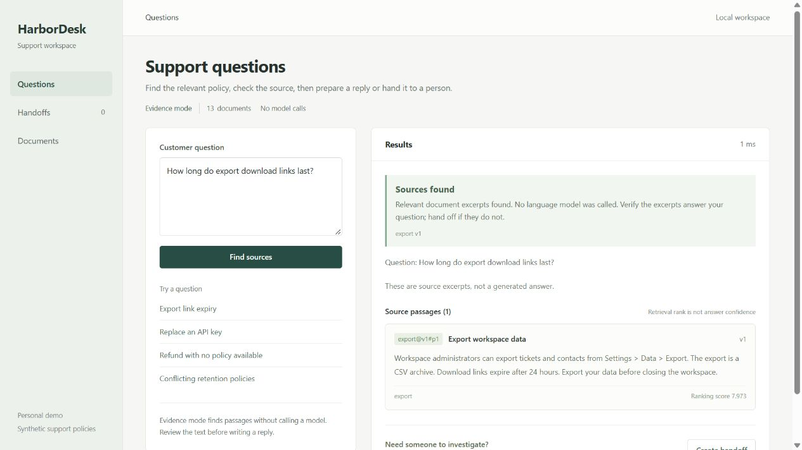

# 带来源与人工交接的客服助手

面向需要反复查产品文档的小型软件客服团队。粘贴客户的问题，查看草稿和引用，逐条核对后复制回复；资料不足时，把问题和已有线索留在本地工单中。

[查看 35 秒检索与交接演示](docs/demo.webm) · [English](README.md) · [实际验证情况](docs/validation.md)

问题 → 查资料 → 写草稿 → 人工核对 → 复制或交接。

这是虚构公司、合成政策的个人项目。无需模型即可作为文档检索工具使用。DeepSeek 接口适配和审核流程已用模拟 HTTP 响应验证，尚未实测真实模型回答。程序不会发送客户消息，也不能操作客户账号。

## 本地启动

需要 Python 3.11 或更新版本；实际验证环境为 Windows / Python 3.14。

~~~bash
git clone https://github.com/myp81607-dot/support-assistant-with-citations.git
cd support-assistant-with-citations
python -m venv .venv
~~~

PowerShell 使用 `.venv\Scripts\Activate.ps1` 激活环境，macOS/Linux 使用 `source .venv/bin/activate`。接着执行：

~~~bash
python -m pip install -r requirements-app.txt
python -m uvicorn support_app.main:create_app --factory --host 127.0.0.1 --port 8123
~~~

打开 [localhost:8123](http://127.0.0.1:8123)。默认不需要密钥，载入 13 篇 HarborDesk 演示文档，编辑和工单保存在 `runtime/support.db`。

可以先问 “How long do export download links last?”，再问 “Can I export tickets as a JSON archive?”。前者有 24 小时的依据，后者没有 JSON 功能资料，需要人工处理。问 “Is customer data retained for 30 days or 90 days?” 会显示故意设置的政策冲突。

启用回答模式后，逐个打开引用，比较草稿断言与引文。引用 ID 有效不等于内容支持该断言。操作者需确认已经核对、填写备注，才能使用 **Copy approved reply**。引用文档更新或出现相关政策标签冲突后，旧草稿不能继续复制，需协调资料并重新提问审核。

## 换成自己的资料

先复制 [examples/documents.json](examples/documents.json)，替换成有权使用的材料，并单独创建一个数据库：

~~~powershell
$env:SUPPORT_DOCUMENTS = 'examples/documents.json'
$env:SUPPORT_DB = 'runtime/my-support.db'
python -m uvicorn support_app.main:create_app --factory --host 127.0.0.1 --port 8123
~~~

这个样例只有两篇文档，导出链接的有效期是 48 小时，不会混入 HarborDesk 资料。JSON 只在数据库没有文档时导入；之后在 **Documents** 中新增正文或保存版本。修改 JSON 文件不会覆盖已存在的数据库。

每条记录放一篇短文，保留稳定的 `id`、清楚的 `title` 和原始 `text`。可选的 `fact_key` / `fact_value` 用于标记应一致的政策，例如两篇文档都用 `export_link_validity`，但时间不同，就会提示冲突。它依赖编辑维护，不是通用语义矛盾检测。

[配置与使用说明](docs/usage.md)给出完整文件格式、错误处理和具体定制入口。

## 启用回答草稿

本版本按 DeepSeek 的 chat-completions 接口配置。密钥放在服务端环境变量中，不放浏览器或提交到仓库：

~~~powershell
$env:SUPPORT_API_KEY = '<your API key>'
$env:SUPPORT_MODEL = 'deepseek-flash'
$env:SUPPORT_API_BASE = 'https://api.deepseek.com'
$env:MODEL_MAX_CALLS = '10'
~~~

然后按前文启动服务。API 调用可能计费；程序关闭 thinking，限制输出为 1,200 token，限制请求大小，不自动重试。取消 `SUPPORT_MODEL` 即回到纯检索。旧版只选择整段原文的模型接口已改成简洁的带引用草稿，无需模型的 evidence 基线仍保留。

模型不可用、额度或限流、输出格式错误、无效引用、引文不在资料中时，都不会显示为已解决。已有检索结果和人工交接入口仍可使用。模型没有外部工具执行权限。

## 测试及适用范围

~~~bash
python -m pytest -q
python -m evaluation.run
~~~

保留原 29 题及原标签。六个旧改写失败通过显式词汇规则修复，并新增支持/不支持的成对回归案例。这些是已见样例的回归结果，不是未知数据上的准确率。[验证说明](docs/validation.md)分开报告检索、引用存在、答案支持、人工批准、真实连接、耗时和费用。

目前是无鉴权、无文档权限隔离的单工作区本地应用，请仅绑定回环地址。英文关键词检索仍需用目标产品的问题集验证，不支持任意同义改写；政策标签也需维护。人工核对是流程的一部分，不代表程序自动证明了回答正确。

适合定制的是小型产品知识库、带引用的回复草稿、资料更新及客服交接流程。开始前需要可使用的文档、代表性问题和转人工规则。本版本不包含公开部署、多租户权限、CRM 发信或自动退款。

原学习脚本 `src/mini_rag_demo.py`、CSV 资料和 Git 历史保持不变，其字符串检查不能视作回答质量评测。实际应用在 `support_app/`；[参考说明](docs/references.md)列出设计来源及许可证。开发和诊断审查使用了 AI 辅助。
